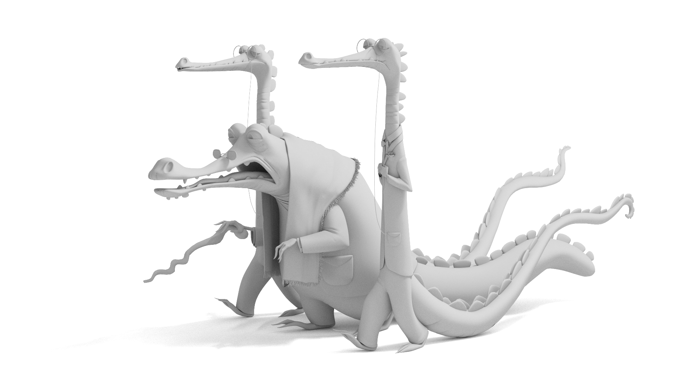

# KPN Denoiser for Raytraced Renders

## Table of Contents
- [Overview](#overview)
- [Installation](#installation)
- [Acknowledgements](#acknowledgements)
- [License](#license)

## Overview 
This project showcases a simple raytracer written in Rust. Though quite simple/naive, the renderer is capable of producing very appealing results in a reasonable timeframe. Importance sampling has been introduced to help converge more efficiently, and the BVH implementation allows for relatively quick scene traversals. The principled material allows for blending of different shading techniques to create varied and realistic surfaces with ease. 

Future improvements currently in development:
-Subdivision scheme (catclark and adaptive)
-Subsurface scattering (diffusion and randomwalk)
-Volumes
-Radiance caching

## Installation 
To run this project, you will need Rust installed and the following dependencies:

rand = "0.8.3"
image = "0.24.5"
indicatif = "0.17.1"
serde_json = "1.0"
show-image = "0.13.1"
rayon = "1.5.1"
num_cpus = "1.14.0"

## Acknowledgements 
This project was inspired by the work of [Shirley et al.](https://raytracing.github.io/)

## License 
This project is licensed under the MIT License - see the LICENSE.md file for details.